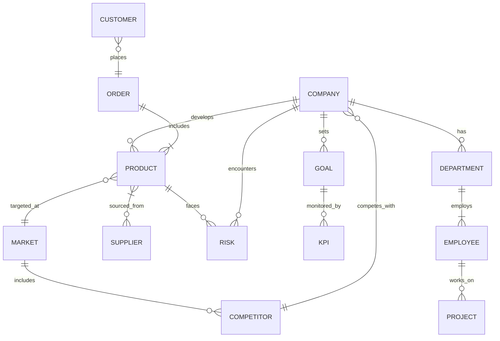
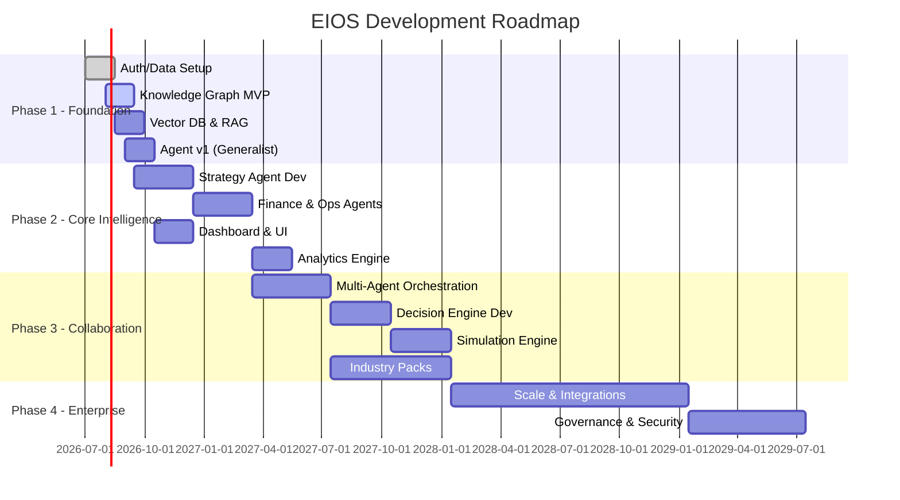

# Enterprise Intelligence OS (EIOS) Documentation

## Executive Summary

Enterprise-Intelligence-OS (EIOS) is an open-source, production-grade AI platform that functions as a full-service consulting system. It combines data ingestion, structured knowledge, multi-agent reasoning, analytics, and decision-support into a unified architecture. Instead of a single monolithic model, **EIOS uses dozens of specialized components** (agent microservices, ML models, databases, workflows, etc.) that work together. Its knowledge base includes business frameworks (Porter’s Five Forces, SWOT, VRIO, etc.), financial and market data, and an enterprise knowledge graph linking entities like Company, Product, Customer, and Risk. Domain-specific AI agents (Strategy, Finance, Operations, HR, IT, etc.) each hold specialized expertise and collaborate through an orchestrator. The system supports retrieval-augmented reasoning, forecasting, optimization, and simulation (Monte Carlo, system dynamics), with outputs like strategy decks, financial models, and KPI dashboards. 

Key points:

- **Modular Multi-Agent Design**: A central orchestrator invokes *specialist agents* (Strategy Agent, Finance Agent, Legal Agent, etc.), each using its own knowledge, tools, and workflows to analyze problems in parallel. Agents communicate via well-defined APIs and a shared knowledge graph/memory.
- **Enterprise Data & Knowledge**: An **Enterprise Data Platform** ingests all company data (ERP, CRM, documents, IoT, cloud, etc.). An **Enterprise Knowledge Graph (EKG)** links entities (Customer, Order, Product, Supplier, Risk, KPI, etc.) and captures ontologies and business rules. A **Memory Engine** stores ongoing context: corporate vision, policies, meeting notes, past analyses, KPIs, and lessons learned.
- **Analytical Engines**: Includes analytics modules for forecasting (ARIMA/Prophet/LSTM), recommendations, classification (churn/fraud), optimization (linear/integer programming), and simulation (Monte Carlo, discrete-event). These feed data to the reasoning layer.
- **Retrieval-Augmented Generation (RAG)**: Documents and knowledge are chunked, embedded, indexed, and retrieved so LLMs always work with factual context. Component frameworks like Haystack or LangChain stitch these steps together, while a high-quality embedding model (e.g. BGE-M3, Qwen-VL) and vector DB (Qdrant, Milvus, etc.) power semantic search.
- **Decision Engine & Workflows**: Every analysis follows a structured workflow: define goals, gather data, apply frameworks (SWOT, 5-Forces, financial models), run scenario simulations, and evaluate trade-offs. A **Decision Engine** applies multi-objective optimization (maximize ROI, minimize risk) and ensures evidence backs each recommendation.
- **Deliverables & Interfaces**: The platform auto-generates polished reports (board decks, strategy memos, risk registers) and exposes dashboards for executives. All outputs are traceable to data sources and models for auditability.
- **Open-Source Technology Stack**: Since no paid LLM APIs are used, the system relies on open models (e.g. Google Gemma, Qwen3, DeepSeek, Llama3) and databases (PostgreSQL, Neo4j, Redis, Qdrant, etc.). Orchestration is done via containers (Docker/Kubernetes) and workflow engines (Temporal, Camunda).
- **Long-Term Roadmap**: Development is staged over quarters: foundation (data ingestion, knowledge graph, basic agent), intelligence (domain agents, workflow, dashboards), collaboration (multi-agent orchestration, simulations), and enterprise scale (ERP/CRM integration, industry-specific packs, governance). Each phase has clear milestones, roles (data engineers, ML engineers, consultants, DevOps), and evaluation criteria.

The sections below provide the **complete system blueprint**: repository structure, module specifications (purpose, APIs, data contracts, tech stack), workflows, data models, code snippets, architecture diagrams, and implementation guidelines. All components tie together to form an “operating system” for enterprise decision intelligence.

---

## Repository Overview

- **Name**: `Enterprise-Intelligence-OS` (abbreviated *EIOS*)
- **Description**: A unified AI platform mirroring a full consulting firm. It integrates enterprise data, domain knowledge, agentic reasoning, analytics, and workflows to assist C‑suite decision-making.
- **Vision**: “Build an AI CEO/CFO/COO in software” – a trusted advisor that continuously analyzes company data and market context to propose strategy, optimize operations, and guide transformations.
- **Core Principles**:
  - *Modularity*: Separate domain agents and services (no single monolith). 
  - *Explainability & Auditability*: Every recommendation links to underlying data, frameworks, and analysis steps.
  - *Evidence-Based*: Decisions rely on data/model outputs, not hallucination.
  - *Scalability & Resilience*: Cloud-native microservices with autoscaling, rolling updates, and fault tolerance.
  - *Security & Governance*: Strict access control, data lineage, and compliance built-in.
  - *Extensible Knowledge*: Frameworks and facts are stored in a graph ontology (not free-form text), enabling semantic reasoning.
  - *Human-in-the-Loop*: The platform suggests options but allows human review, feedback, and override.

```text
High-Level Architecture (simplified)

User Interface (web, mobile)
      │
      ▼
Executive Intelligence Layer
      │
┌───────────────┐
│Agent          │
│Orchestrator   │
└───────────────┘
      │
├─────────────────────────────────────────────────────────┐
│ Strategy AI  │ Finance AI  │ Ops AI  │ HR AI  │ Legal AI │ ... │  (Specialized Agents)
└─────────────────────────────────────────────────────────┘
      │
      ▼
Enterprise Reasoning Engine (Decision logic, Optimization)
      │
      ▼
Knowledge Graph + Enterprise Memory (context, rules)
      │
      ▼
Data Platform (Data Lake, Databases, APIs, ML services, ERP/CRM connectors)
```

Here **no single LLM does everything**. Instead, a central *Orchestrator/Planner* delegates tasks to specialized agents. For example, a strategic expansion question may spawn a “Strategy Agent” to analyze market, a “Finance Agent” to model P&L, a “Legal Agent” to check regulations, etc. These agents retrieve relevant data (via RAG, graphs, or APIs), perform domain-specific analysis, and return findings. The orchestrator then aggregates their insights through the Decision Engine, which weights objectives (cost, risk, ROI) and produces final recommendations with supporting evidence.

Below is a high-level *knowledge graph ontology* illustrating the semantic backbone. Entities are classes (boxes) and relationships (arrows) define how concepts link:



- **Entities**: Company, Department, Employee, Project, Product, Supplier, Customer, Order, Risk, Goal, KPI, Market, Competitor, etc.
- **Relationships**: *Company has Departments; Departments have Employees; Customers place Orders containing Products; Products are sourced from Suppliers; Goals are tracked by KPIs; Companies face Risks; etc.* 
- This graph is implemented in a graph database (e.g. Neo4j, Memgraph, NebulaGraph). It enables queries like “Which customers bought Product X and belong to industry Y that’s impacted by regulation Z?”—a traversal across multiple relationship hops (which relational tables cannot answer efficiently).

## Repository Structure

```
Enterprise-Intelligence-OS/
│
├── apps/                     # User-facing applications (dashboards, frontends)
│   ├── executive-dashboard/  # CEO/CXO web UI (React/Next.js)
│   ├── admin-dashboard/      # Admin/IT interface
│   ├── analyst-workbench/    # Analyst UI for reports
│   └── mobile/              # Mobile app (React Native / Flutter)
│
├── services/                 # Backend microservices
│   ├── api-gateway/          # API gateway (routing, load-balancing)
│   ├── auth-service/         # Authentication & RBAC (OAuth2, JWT)
│   ├── workflow-engine/      # Orchestration of multi-step processes
│   ├── reasoning-engine/     # Core logic/decision engine (LLM orchestration)
│   ├── report-engine/        # Document/report generation service
│   ├── notification-service/ # Email/SMS/Slack alerts
│   └── scheduler/            # Periodic jobs and pipeline triggers
│
├── agents/                   # Specialized AI agents (domain experts)
│   ├── strategy/             # Strategy analysis agent
│   ├── finance/              # Financial analysis agent
│   ├── operations/           # Operations/process agent
│   ├── marketing/            # Marketing analytics agent
│   ├── sales/                # Sales forecasting agent
│   ├── hr/                   # HR/people analytics agent
│   ├── technology/           # IT/cybersecurity agent
│   ├── product/              # Product management agent
│   ├── innovation/           # R&D/innovation agent
│   ├── legal/                # Legal and compliance agent
│   ├── procurement/          # Procurement/supply-agent
│   ├── manufacturing/        # Manufacturing agent
│   ├── supply-chain/         # Supply chain optimization agent
│   ├── risk/                 # Enterprise risk agent
│   ├── negotiation/          # Negotiation/pricing agent
│   ├── investment/           # M&A/investment agent
│   ├── ai/                   # Internal AI/ML advisory agent
│   └── executive/            # CEO/vision & leadership agent
│
├── knowledge/                # Business knowledge (frameworks, models, data)
│   ├── frameworks/           # Strategy and analytic frameworks (Porter, BCG, etc.)
│   ├── methodologies/        # Project & process methodologies (Agile, Lean, etc.)
│   ├── books/                # Summaries of key textbooks and papers
│   ├── research/            # Academic & industry research
│   ├── industry-models/      # Industry-specific benchmarks and reference models
│   ├── regulations/         # Legal and regulatory text
│   └── taxonomies/          # Concept hierarchies and ontologies
│
├── graph/                    # Knowledge Graph schema and builder
│   ├── ontology/             # Entity and relationship definitions (OWL/RDF or similar)
│   ├── schemas/             # Graph database schema (property definitions, constraints)
│   ├── relationships/       # Relationship templates/rules
│   └── graph-builders/      # Code to ingest data and populate the graph
│
├── memory/                   # Persistent agent memory
│   ├── enterprise-memory/    # Long-term memory (corporate wiki, past decisions)
│   ├── episodic/            # Session logs and conversation history
│   └── semantic/            # Fact base (derived from memory consolidation)
│
├── ml/                       # Machine Learning services
│   ├── forecasting/         # Time-series models (ARIMA, Prophet, LSTM, etc.)
│   ├── classification/      # Predictive models (risk, churn, segmentation)
│   ├── optimization/        # Solvers (linear programming, portfolio optimization)
│   ├── simulation/          # Simulation models (Monte Carlo, system dynamics)
│   └── evaluation/          # Model evaluation and validation scripts
│
├── rag/                      # Retrieval-Augmented Generation pipelines
│   ├── ingestion/           # Document parsing and preprocessing
│   ├── embedding/           # Embedding model selection and inference
│   ├── indexing/            # Vector store indexing scripts
│   ├── retrieval/           # Retrieval/ranking logic
│   └── reranking/           # (Optional) secondary ranking of results
│
├── data/                     # Data integration and pipelines
│   ├── connectors/          # API/DB connectors (Salesforce, SAP, Workday, etc.)
│   ├── pipelines/           # ETL/ELT pipelines
│   ├── transformations/     # Data cleaning and normalization code
│   └── datasets/            # Static sample datasets and schema
│
├── simulations/              # Scenario simulation and scenario planning
│   ├── monte-carlo/         # Monte Carlo simulation templates
│   ├── sensitivity/         # Sensitivity/what-if analysis code
│   ├── dynamic/             # System dynamics models
│   └── stochastic/          # Discrete-event simulation models
│
├── reports/                  # Report templates and generators
│   ├── board/               # Board presentation templates
│   ├── strategy/            # Strategy report templates
│   ├── finance/             # Financial model templates
│   ├── operations/          # SOPs, process docs
│   ├── risk/                # Risk register templates
│   └── templates/          # Generic templates (OKRs, roadmaps, etc.)
│
├── docs/                     # Documentation (design, architecture, user guides)
│
├── tests/                    # Test suites (unit, integration, e2e)
│
├── deployments/              # Kubernetes manifests, Helm charts, Terraform scripts
│
├── scripts/                  # Utility scripts (db migrations, data import, etc.)
│
└── README.md
```

Each folder corresponds to a major domain of functionality. For example, the `agents/strategy` directory contains the code, prompts, and tools for the Strategy Agent (including sector analysis, competitive frameworks, growth models). The `graph/` directory holds ontologies and code that builds the Enterprise Knowledge Graph. The `ml/forecasting` directory contains training/prediction code for demand forecasting, revenue forecasting, etc. 

---

## Module Specifications

Below we describe each major module, its purpose, key APIs/contracts, tech stack, CI/CD considerations, security, and sample code.

### 1. Apps (Frontend)

**Purpose:** Provide user interfaces for stakeholders. Includes: 
- **Executive Dashboard:** Real-time KPIs, forecasts, strategy suggestions (built with React/Next.js or similar).
- **Admin Dashboard:** Manage users, roles, data sources, system settings.
- **Analyst Workbench:** A sandbox UI where data analysts can run custom reports or explore the knowledge base.
- **Mobile App:** Lightweight interface for alerts, summaries, and Q&A on the go.

**Tech Stack:** React or Next.js for web (TypeScript, Tailwind CSS), React Native or Flutter for mobile. Use Auth0/Keycloak for login. Communication via REST/GraphQL to backend.

**APIs & Endpoints:** The frontend consumes backend APIs exposed by `api-gateway` and others. Example endpoints:
- `GET /api/metrics?since=...` – fetch KPIs for dashboard.
- `POST /api/consult` – submit a question/consult request to be handled by agents.
- `GET /api/reports/{id}` – retrieve a generated report (PDF/PowerPoint).
- `GET /api/graph/entity/{id}` – fetch knowledge graph info for an entity.

**Data Contracts:** JSON schemas for requests/responses. E.g. a consultation request:
```json
{
  "user_id": "U123",
  "question": "Should we enter the German market?",
  "context": {"company_profile": {...}}
}
```
Responses include structured insights and references:
```json
{
  "recommendation": "Yes, enter with Product line A",
  "alternatives": ["No entry", "JV in UK"],
  "confidence": 0.82,
  "evidence": ["MarketGrowth_2025_Report.pdf", "RiskAnalysis.xlsx"]
}
```

**CI/CD:** Frontend pipelines (GitHub Actions or GitLab CI) lint TypeScript, run UI tests (Jest, Cypress), and build Docker images. On merge to `main`, auto-deploy to staging (via Kubernetes/Helm) then to production upon approval.

**Security & Observability:** Web UI enforces SSO (SAML/OAuth), uses secure cookies, CSRF tokens. Monitor via browser analytics (user flows, errors) and aggregate metrics (page load times). Use OpenTelemetry for frontend event tracing.

**Sample Code (TypeScript):** A simplified Next.js API route for retrieving KPIs:
```typescript
// pages/api/metrics.ts
import type { NextApiRequest, NextApiResponse } from 'next';
import fetch from 'node-fetch';

export default async function handler(req: NextApiRequest, res: NextApiResponse) {
  // Proxy to backend service
  const { since } = req.query;
  const backendRes = await fetch(`http://api-gateway/metrics?since=${since}`);
  const data = await backendRes.json();
  res.status(backendRes.status).json(data);
}
```

### 2. Services (Backend)

This group contains core backend microservices, typically implemented in Python (FastAPI) or Node/NestJS, each in its own container.

- **API Gateway:** Entry point for all API calls. Routes requests to appropriate service, handles load balancing and TLS termination. Implements rate-limiting and basic health checks. Example: route `/api/consult` to the Workflow Engine.
  
- **Auth Service:** Manages user accounts, single sign-on, permissions (RBAC), and multi-tenancy. Issues JWTs. Protects all service endpoints (via middleware). Could use Keycloak or Auth0 (self-hosted). Data store: PostgreSQL or LDAP. Auditable logs of login attempts.

- **Workflow Engine:** Orchestrates multi-step processes. Example workflow: *Expansion Study* (see diagram below). Internally uses Temporal (or Camunda) to model each step as an activity. Workflows are defined as code, e.g.:
  ```python
  @workflow.defn
  def expansion_analysis(company, target_market):
      data = yield Temporal.start_activity("CompanyAnalysis", company)
      market = yield Temporal.start_activity("MarketAnalysis", target_market)
      finance = yield Temporal.start_activity("FinancialModel", [company, target_market])
      # Aggregate insights
      recommendation = yield Temporal.start_activity("DecisionEngine", [data, market, finance])
      return recommendation
  ```
  Temporal ensures durability and retry. The Workflow Engine exposes endpoints to start workflows (`POST /api/workflows/expansion`) and query status (`GET /api/workflows/{id}`).

- **Reasoning Engine:** Coordinates the AI agents. It takes a high-level question, breaks it into sub-questions, assigns to agents, and integrates their answers. Implements planning logic and uses LLMs or rule engines. E.g. a question “Reduce costs by 10%” might spawn operations, finance, and strategy agents. This service composes prompts and uses LLMs (via open-source engines) to refine hypotheses.

- **Report Engine:** Generates formatted deliverables. It may use Python libraries (`python-pptx`, `reportlab`, `pandoc`, etc.) or templating to fill in data and charts into pre-designed templates. Exposes endpoints like `POST /api/reports/{type}` returning a downloadable PDF/PPTX. Templates stored under `reports/templates/`.

- **Notification Service:** Sends alerts and updates (email, Slack, SMS). Subscribes to event bus (e.g. Kafka) for items like “new recommendation”, “threshold breach”. Uses SMTP or services like SendGrid/Slack API. Logs all notifications for audit.

- **Scheduler:** Runs periodic jobs (via cron or a scheduling framework). Examples: nightly data sync from ERP, weekly KPI refresh, monthly model retraining, quarterly regulatory checks. Uses tools like Apache Airflow or a simple Celery Beat schedule. Ensures idempotency and alerts on failures.

**Data Contracts & APIs:** Each service defines its own REST or gRPC API. For example, the Finance Agent might expose `/api/finance/forecast` accepting JSON input (historical financials) and returning a forecast. Use OpenAPI/Swagger for all HTTP services. Message contracts (for Kafka or RabbitMQ) should use versioned protobuf or JSON schemas.

**Tech Stack:** FastAPI or NestJS/Koa for services; PostgreSQL (relational), Redis (caching/session), Kafka/NATS (events), RabbitMQ (tasks), Elasticsearch (search logs), MinIO (object storage). Languages: Python for ML-heavy services, TypeScript for I/O services. Containerized with Docker, orchestrated via Kubernetes.

**CI/CD:** Each service has its own pipeline. Typical job stages: checkout → lint/type-check → unit tests → build Docker image → push to registry → deploy to Kubernetes. Use semantic versioning and image tags by commit SHA. Run API/contract tests against a test environment. Integrate security scanning (bandit for Python, npm audit) and SAST in pipeline.

**Security & Observability:** All service-to-service calls use mTLS or auth tokens. Implement rate limiting and input validation. Log all requests with correlation IDs. Expose metrics via Prometheus client (request counts, latencies, error rates). For example:
```python
from prometheus_client import Counter, Histogram
REQUEST_COUNT = Counter('http_requests_total', 'Total HTTP Requests', ['service','endpoint'])
REQUEST_LATENCY = Histogram('http_request_latency_seconds', 'Latency by endpoint', ['service','endpoint'])
```
Integrate with Grafana dashboards. Use distributed tracing (OpenTelemetry) to trace a request across multiple services. Require regular penetration testing of APIs.

**Example Endpoint (FastAPI/Python):**
```python
# services/api-gateway/main.py
from fastapi import FastAPI, Request
import httpx

app = FastAPI()
@app.post("/api/consult")
async def handle_consult(req: Request):
    body = await req.json()
    # Forward to workflow engine
    async with httpx.AsyncClient() as client:
        res = await client.post("http://workflow-engine/consult", json=body)
    return res.json()
```

### 3. Agents (AI Modules)

Each agent is an autonomous microservice with domain expertise. They typically accept structured inputs and produce structured outputs (analysis, scores, recommendations). Key aspects for each agent:

- **Capabilities:** Domain-specific knowledge (e.g. Strategy Agent knows about market analysis, competitive dynamics; Finance Agent knows accounting/valuation; Operations Agent knows process optimization). They often embed known frameworks as logic or prompt templates (e.g. SWOT, Porter’s 5-Forces for strategy; DCF model for finance).
- **Tools:** They can call LLMs (via an open-source model endpoint), query vector stores (for memory), run local ML models (scikit-learn, PyTorch), or invoke optimization solvers (e.g. PuLP, OR-Tools).
- **Inputs:** Each agent receives relevant data. The orchestrator passes context (company profile, data references, extracted parameters). Agents may retrieve additional data (historical numbers, market data) via the Data Platform APIs or graph.
- **Outputs:** JSON results such as numeric KPIs, charts, and natural-language commentary. For example, Finance Agent might output `{ "net_profit":12345, "recommendation": "Raise prices by 5%", "confidence": 0.9 }`.
- **Evaluation:** Each agent includes logic to self-validate (e.g. cross-checks, back-of-envelope calculations) and can escalate uncertainties back to the orchestrator.

**Agent Taxonomy Examples:**  

| Agent            | Capabilities                               | Tools & Data                                   | Inputs                      | Outputs                  | Evaluation Metrics                   |
|------------------|--------------------------------------------|-----------------------------------------------|-----------------------------|--------------------------|--------------------------------------|
| **Strategy**     | Market sizing, competitive analysis, mergers & growth strategy; uses Porter’s 5 Forces, Ansoff Matrix | LLM for synthesis, industry research data, Knowledge Graph (competitors, products) | Customer profiles, market reports | Strategic options, prioritized growth areas | Strategic KPI coverage, expert review |
| **Finance**      | Financial modeling (P&L, cash flow, valuation), budgeting, scenario analysis; uses DCF, ratio analysis | Python (pandas, NumPy), Prophet/ARIMA, LLM for explanations | Financial statements, budgets      | Forecasts, funding needs, valuation metrics | RMSE of forecasts, audit with FP&A    |
| **Operations**   | Process optimization, inventory/logistics planning, capacity utilization; uses Lean/SixSigma tools | Optimization solver (PuLP), simulation, IoT data | Production data, order history     | Efficiency recommendations (batch size, reorder points) | Throughput improvements, cost savings |
| **Marketing**    | Customer segmentation, campaign ROI, brand analysis; uses 4P’s, Kano model | ML segmentation, social media data, survey text (via embedding) | CRM data, ad metrics, surveys      | Target segments, channel mix | Engagement lifts, conversion rates    |
| **HR**           | Talent planning, churn prediction, org design; uses 9-box grid, competency models | HRIS data, network analysis, ML (attrition), LLM (policy drafting) | Workforce demographics, attrition trends | Hiring plans, turnover risks | Retention rates, hiring efficiency    |
| **IT/Cyber**     | Technology roadmapping, cybersecurity risk; uses TOGAF, COBIT frameworks | Security logs, architecture inventory, vulnerability scanners | IT asset registry, incident logs    | Upgrade plans, risk remediation | Downtime reduction, risk scores       |
| **Legal/Compliance** | Regulatory check, contract analysis; uses internal policies, legal statutes | Document NLP (e.g. contract parsing), compliance checklists | Contracts, industry regs           | Compliance status, litigation risks | Audit findings, compliance metrics    |
| **Risk**         | Enterprise risk assessment (credit, market, operational); uses Monte Carlo and Value-at-Risk | Risk modeling libs, past incident data       | Historical financials, market volatility | Risk heat map, mitigation plan | VaR coverage, loss events             |
| **Sales**        | Pipeline forecasting, lead scoring; uses quota models, pricing elasticity | CRM data, pricing data, elasticity models    | Pipeline CRM records, historical conversion | Sales forecast, recommended quotas | Forecast accuracy, attainment rates   |

(*Table: Example agents; each defines its **capabilities**, required **tools/data**, **inputs**, **outputs**, and how we measure its quality.*)

Agents communicate with the Knowledge Graph and Memory. For instance, the Finance Agent may query the graph for “current contracts with Supplier X” or retrieve past forecasting errors from Memory to calibrate its model.

### 4. Knowledge Base

**Purpose:** Stores all codified business knowledge: consulting frameworks, models, definitions, case studies, industry benchmarks, legal rules, etc. This is *static, structured knowledge* that the AI references.

- **Frameworks & Methodologies:** Models like Porter's Five Forces, BCG Matrix, Balance Scorecard, Agile/Six Sigma, etc. These should be represented as first-class objects (templates or graph entities) that agents can apply. For example, the `knowledge/frameworks/porters_five_forces.json` file might define the five forces and generic questions for analysis.
- **Models & Reference Data:** Standard financial models (DCF templates), HR benchmarks, marketing personas, engineering best practices. These can be encoded as formulas or parametric tools.
- **Ontologies & Taxonomies:** Business taxonomy (e.g. organizational hierarchy levels, product categories, industries), regulatory ontologies, glossary of business terms.
- **Source Materials:** Texts (whitepapers, market research PDFs), SEC filings, academic papers are ingested here and linked to ontology nodes.

**Integration:** Content from this directory is parsed (using NLP and entity linking) to enrich the Knowledge Graph. For example, a PDF on “Retail Market 2025” is chunked, key statistics are extracted, and linked to existing graph entities (Product, Market). Framework definitions become graph nodes (e.g. a “Porter’s Five Forces” node with edges to “Competitive Rivalry”, “Supplier Power”, etc.), enabling agents to query “what forces affect our industry”.

**Maintenance:** Version control tracks changes. A data pipeline (`knowledge/frameworks/ingest/`) automatically updates the graph when new knowledge is added. 

**Example:** A JSON snippet for Porter’s Five Forces framework:
```json
{
  "framework": "Porter's Five Forces",
  "forces": ["Competitive Rivalry", "Supplier Power", "Buyer Power", "Threat of Entry", "Threat of Substitutes"],
  "questions": {
    "Competitive Rivalry": "How intense is competition among current players?",
    ...
  },
  "applicable_industries": ["Manufacturing", "Retail", "Tech"],
  "sources": ["harvard_business_review_1979.pdf"]
}
```

### 5. Knowledge Graph

**Purpose:** The EKG is the central semantic database. It fuses data from *Enterprise Data Platform* (ERP, CRM, documents) into a unified graph of facts. The ontology defines entity types (Company, Person, Product, KPI, Risk, etc.), relationship types (e.g. “works_at”, “purchased_by”, “affects”, “targets”), and inference rules (e.g. class hierarchies).

**API & Schema:** Exposes a graph query endpoint (e.g. Cypher for Neo4j) and a simple REST API for common lookups (e.g. `/api/graph/search?entity=Customer&name=Smith`). Schema is defined under `graph/schemas` (RDF or property graph schema). Data contracts follow the ontology: e.g., a Company node JSON looks like `{"id":123,"name":"ACME Corp","sector":"Manufacturing","founded":1998}`.

**Graph Database:** Possible choices include:
- **Neo4j (Community Edition)** – widely used property graph, strong Cypher query language.
- **Memgraph** – in-memory real-time graph with ACID support.
- **ArangoDB** – multi-model (graph+document).
- **JanusGraph** – scalable, pluggable backends (Cassandra, Elasticsearch).
- **NebulaGraph** – built for trillions of edges.
Given the scale (millions of nodes/edges) and relationships, we favor a distributed graph DB (Neo4j Enterprise or NebulaGraph).

**Data Flows:** ETL jobs populate the graph:
- **Master Data Sync:** Sync core records (Customers, Products, Employees) from ERP/CRM nightly.
- **NLP Ingestion:** Parse documents (PDFs, emails) with NLP pipelines to extract entities/relations and merge them (entity resolution is critical: e.g. “J. Smith” in CRM vs “John Smith” in support logs should unify).
- **Graph Jobs:** Scheduled jobs run graph analytics (centrality, similarity) to detect clusters or suggest merges.

**Insights:** The graph supports queries like: 
> *“Find all employees who report to a manager who approved a high-risk project that lost money last quarter.”*

By treating relationships as first-class (no SQL JOINs needed), the system can answer cross-domain queries efficiently. For example, a single query can traverse `Customer – Order – Product – Supplier – Risk` to see how a supply chain disruption might impact revenue.

### 6. Memory Model

**Purpose:** Maintain context over time. In conversational or long-term analysis, the AI must remember prior interactions, decisions, and events (beyond a single session).

**Memory Types (Cognitive Taxonomy):** We implement all three types of long-term memory:

- **Semantic Memory:** Facts and concepts (e.g. “Company’s 2025 sales target is $X”, “Preferred vendor is Y”, domain knowledge). Stored as structured knowledge in the Graph or a document store.
- **Episodic Memory:** Logged events and conversations (e.g. “Jan meeting: CEO prefers a cautious approach”, “Last simulation showed 20% risk of shortfall”). Stored as timestamped notes or vector embeddings of transcripts.
- **Procedural Memory:** Reusable routines and policies (e.g. prompt templates, standard operating procedures, code snippets for financial calculations). These live in code/config or as knowledge graph templates.

**Implementation:** A **Memory Engine** combines a vector store (for semantic recall) and a document store:
- Short-term session logs and transcripts are chunked, embedded, and added to a **Memory Vector DB** (like Qdrant/Milvus) for retrieval.
- Persistent knowledge (user profiles, corporate policies, KPI baselines) are stored in databases or the knowledge graph.
- On each agent invocation, relevant memory is fetched (“read-before-reasoning”) and after analysis, new findings are written back (“write-after-acting”).

**Example Usage:** If the CEO said “I like presentations that are concise” in a previous session, the assistant remembers this preference and adjusts its formatting. If a risk analysis was done last quarter, that result is stored and referenced in new scenarios.

**Tools:** Redis can be used as an in-memory cache for fast recalls; vector DB + Pinecone/Chroma for larger memory. The Redis Labs blog outlines such architectures. We also apply periodic consolidation: key episodic notes are summarized (via LLM) into semantic memory.

### 7. Analytics & ML Services

EIOS includes a suite of ML/analytics models, each exposed via a service API. Examples:

- **Forecasting Services:**  
  - *Revenue/Demand Forecasting:* Time-series models (Prophet, ARIMA, LSTM, TFT) for sales, inventory needs.  
  - *Churn Prediction:* Classification model to predict customer churn probability (using scikit-learn / XGBoost).  
  - *Example:* A Flask/Python endpoint `POST /ml/forecast/sales` accepts historical monthly sales data (CSV/JSON) and returns a forecast for the next 12 months (mean and confidence intervals).  

- **Recommendation/Optimization:**  
  - *Product Recommendation:* Suggest cross-sell/upsell using collaborative filtering or content-based (via embeddings).  
  - *Pricing Optimization:* Given cost and demand curves, find optimal price points (using gradient search or reinforcement learning).  
  - *Example:* An API `POST /ml/optimize/inventory` might take cost, demand model params, and return optimal order quantities using a linear programming solver.

- **Risk & Classification:**  
  - *Credit/Fraud Risk Model:* Classification/regression models (Logistic Regression, Random Forest, or transformers) output probability of default or fraud for an entity.  
  - *Example:* `GET /ml/risk/credit-score?client_id=12345` returns risk score.
  
- **Anomaly Detection:**  
  - Detect outliers in financial transactions or sensor data (Isolation Forest, One-Class SVM, LSTM autoencoders).  
  - Example: Daily batch job runs anomaly detection on sales figures to flag suspicious drops/increases.
  
- **Data Science Notebook:**  
  - The `services` directory can include a JupyterLab or Azure ML interface for analysts to prototype ML tasks. Model training pipelines are managed with Kubeflow or MLflow.

**Tech Stack:** Python (Pandas, NumPy, scikit-learn, PyTorch, TensorFlow, Prophet), R (for econometric models), Rust/C++ for performance-critical algorithms. Use Dockerized ML models served via FastAPI/Uvicorn or TensorFlow Serving.

**CI/CD & Deployment:** Models are versioned (MLflow or weights registry). Pipelines rebuild models on data drift or periodically. Use GPU-enabled pods for training, CPU pods for inference. Automated tests include model accuracy checks on validation sets.

### 8. Retrieval-Augmented Generation (RAG)

**Purpose:** Ensure LLM-based reasoning is grounded in factual context. The RAG pipeline ingests documents (company manuals, reports, web data) and makes their content retrievable during generation.

**Pipeline Stages:**

1. **Ingestion & Parsing:** Convert raw sources (PDFs, DOCs, scraped HTML) into text. Use OCR (e.g. Tesseract) for scanned docs. Tools like `python-pdfminer` or Azure Cognitive Services can extract text/tables. Store raw files in object storage and texts in a document store.

2. **Chunking:** Split text into semantically coherent chunks (~200–1000 words) using sentence boundaries and semantic breakpoints. The DigitalOcean guide emphasizes that *chunking granularity impacts retrieval quality*. Implement sliding windows to handle overlaps for context continuity.

3. **Embedding Generation:** Use an open-source text embedding model (e.g. Qwen-Embedding, BGE-M3, all-mpnet) to convert chunks to vectors. The choice depends on modality and languages. BentoML notes that models like **Qwen3-Embedding** (multilingual) or **BGE-M3** (100+ languages) are top candidates. For multimodal docs (images, PDFs), use CLIP-based or multi-modal embeddings (e.g. Jina Embeddings v4 can handle text+images).

4. **Indexing:** Store embeddings in a **Vector Database**. Options include Qdrant, Milvus, Weaviate, or a simpler in-DB solution (pgvector). Milvus benchmarking suggests: *“Qdrant for high-throughput filtered search; Milvus for billion-scale vectors; Chroma for prototyping”*. We pick Qdrant for production (Rust-based, strong filtering). The vector DB is kept synchronized and shards well beyond millions of vectors.

5. **Retrieval & Reranking:** On a query, embed the query text and find the nearest chunk embeddings. Possibly apply metadata filters (e.g., only recent docs). Optionally apply a second-stage reranker (like a cross-encoder) to refine top-K hits. Retrieved chunks are passed as context to the LLM.

6. **Generation:** The selected chunks are concatenated (with citations) and fed to an LLM (e.g. a fine-tuned Qwen or DeepSeek model). The prompt includes instructions, retrieved context, and the user query. This grounding greatly reduces hallucinations.

**Frameworks:** Use Haystack or LangChain libraries to coordinate steps. For example, a LangChain `RetrievalQA` chain encapsulates retrieval + LLM. The DigitalOcean guide emphasizes that *Haystack excels at production pipelines, while LangChain is great for prototyping*.

**Example (Python) RAG Snippet:** Using LangChain with ChromaDB (vector DB) and Qwen embeddings:
```python
from langchain.chains import RetrievalQA
from langchain.vectorstores import Chroma
from langchain.embeddings import QwenEmbedding
from langchain.llms import QwenLLM

# Initialize embedding model and vector store
embedder = QwenEmbedding(model_name="Qwen-Embedding-2B")
vectordb = Chroma(persist_directory="./data/chroma_store", embedding_function=embedder)

# Create QA chain
qa = RetrievalQA.from_chain_type(
    llm=QwenLLM(model="Qwen-3-7B"), 
    chain_type="stuff", 
    retriever=vectordb.as_retriever(search_kwargs={"k":5})
)

# Run query
result = qa.run("What are the risks of entering the Asian market in 2026?")
print(result)  # Generated answer with references to sources
```

### 9. Data Platform & Connectors

**Data Sources:** The system ingests *all* relevant data. This includes:

- **Internal Systems:** ERP (SAP, Oracle), CRM (Salesforce, Dynamics), HRIS (Workday), Financial systems (QuickBooks, Xero), Project Management (Jira, Asana), Support (Zendesk), IoT/sensor feeds, Marketing (Google Analytics, Ad platforms), Email archives, Code repos (GitHub), etc.
- **Documents:** PDFs, spreadsheets, presentations, wiki pages, meeting transcripts.
- **External Data:** Market research reports, SEC filings, news feeds, economic indicators (via APIs like Quandl, government data), industry benchmarks.
- **Communications:** Slack/Teams messages, email threads, meeting transcripts (via transcription).

**Integration Patterns:**
- **Event-Driven:** For real-time sync (e.g., a new sale in CRM triggers an update), use webhooks or a CDC system (Debezium, Kafka Connect).
- **Batch ETL:** Nightly jobs to pull data via APIs (Salesforce, SAP OData) or copy from databases.
- **Data Lake:** Raw and processed data may land in a data lake (S3/MinIO) for large datasets. Then transformed into analytics tables (for ML training).
- **Federation:** When possible, query data in place (e.g. via SQL or GraphQL) rather than full copying, to ensure freshness.
- Use tools like **Airbyte**, **Fivetran**, or custom Python ETL for connectors. For example, an Airbyte connector can sync Salesforce Leads daily into a PostgreSQL table for the Sales Agent to use.

**Data Contracts:** Ensure each connector documents schemas. For example, a connector might map Salesforce `Contact` object to a standard JSON schema (`id`, `name`, `email`, `customer_status`, etc.) and publish it on the Event Bus when new records appear. The Knowledge Graph builder subscribes to these events to update graph nodes.

**Example Connector (Python):** Fetching CRM data:
```python
import requests, psycopg2

# Example: Pull accounts from Salesforce REST API
sf_token = get_salesforce_token()
headers = {"Authorization": f"Bearer {sf_token}"}
accounts = requests.get("https://api.salesforce.com/v52.0/query/?q=SELECT+Id,Name+FROM+Account", headers=headers).json()['records']

# Save to Postgres
conn = psycopg2.connect(...)
for acct in accounts:
    cursor = conn.cursor()
    cursor.execute("INSERT INTO crm_accounts (id,name) VALUES (%s,%s) ON CONFLICT(id) DO UPDATE SET name=%s",
                   (acct['Id'], acct['Name'], acct['Name']))
conn.commit()
```

### 10. Simulation & Scenario Analysis

Executives frequently ask “What if?” questions. The Simulation Engine answers by modeling business processes under uncertainty:

- **Monte Carlo Simulations:** E.g. simulate 1,000 scenarios of sales vs. market growth vs. costs to produce probability distributions of profit. Useful in finance (VaR) or operational risk.
- **System Dynamics / Agent-Based Models:** To study complex systems (supply chain flows, market ecosystems).
- **Optimization Simulators:** E.g. vehicle routing for logistics (with OR-Tools), crew scheduling.
- **Scenario Manager:** Allows users to define scenarios (vary price, investment levels) and run simulations. The engine generates outputs: projected revenue, cash flow, market share, risks, timelines.

**Example (Pseudo-Python):**
```python
import numpy as np

def monte_carlo_revenue(base_demand, price, volatility, trials=10000):
    results = []
    for _ in range(trials):
        # Assume demand ~ Normal(base, volatility)
        demand = np.random.normal(base_demand, volatility)
        revenue = max(0, demand) * price
        results.append(revenue)
    return np.percentile(results, [5,50,95])  # 90% confidence interval

# Usage
ci_low, ci_med, ci_high = monte_carlo_revenue(10000, price=50, volatility=2000)
print(f"Revenue 90% CI: ${ci_low:.0f} to ${ci_high:.0f}")
```

No specific citations needed; these are standard techniques.

### 11. Reporting & Deliverables

The system auto-generates professional consulting artifacts:

- **Strategy Decks:** Visual slide decks (PowerPoint) covering analysis, charts (via matplotlib/Plotly), and text explanations.
- **Board Reports:** PDF reports summarizing metrics, progress, and recommendations.
- **Financial Models:** Spreadsheets (Excel/CSV) with forecast and scenario inputs. 
- **Market Research Reports:** Collated findings with charts.
- **Business Cases & Memos:** Narrative documents combining tables and prose.
- **Risk Registers, Project Plans, SOPs, OKRs:** Templated structured documents.
- **API/PDF Output:** All reports have associated JSON metadata (e.g. list of data sources used, timestamp, author agent).

**Sample Code:** Generating a simple PPTX with charts:
```python
from pptx import Presentation
from pptx.util import Inches
from io import BytesIO
import matplotlib.pyplot as plt

prs = Presentation()
slide = prs.slides.add_slide(prs.slide_layouts[5])
title = slide.shapes.title
title.text = "Sales Forecast 2026"

# Generate chart image
plt.plot([1,2,3,4], [10,15,12,20])
plt.title("Projected Sales")
buf = BytesIO()
plt.savefig(buf, format='png')
buf.seek(0)

# Add image to slide
left = Inches(1); top = Inches(2)
slide.shapes.add_picture(buf, left, top, width=Inches(6))

prs.save("sales_forecast.pptx")
```

### 12. Docs, Tests, Deployments, Scripts

- **docs/**: Contains system design docs, API manuals, and usage guides (as Markdown). Should include architecture diagrams (like this document) and coding conventions.
  
- **tests/**:  
  - *Unit Tests* (PyTest, Jest) for individual functions and methods.  
  - *Integration Tests* to verify end-to-end flows (e.g. running a sample “consult” question through the orchestrator to agents and validating the JSON format).  
  - *Regression/E2E Tests* using tools like Cypress or Postman to simulate user scenarios.  
  - *ML Evaluation* tests: compare model outputs against benchmark datasets.  
  - *Code Coverage*: ensure >80% for critical modules.

**Testing Matrix Example:**

| Test Type            | Tooling                | Purpose                                 |
| -------------------- | ---------------------- | --------------------------------------- |
| Unit (Business Logic)| PyTest (Python), Jest (TS)  | Verify core functions (e.g. data transformations, agent prompt generation). |
| Integration (Services)| REST Assured, Postman, FastAPI TestClient | Validate API chains (gateway→service→DB). |
| E2E (Workflows)      | Playwright/Cypress     | Simulate user flows (e.g. login → submit question → view report). |
| ML Model Tests       | PyTest + custom scripts| Check accuracy, drift of forecasts/classifiers. |
| Security Scan        | Trivy (containers), Snyk (code) | Find vulnerabilities, OWASP checks.      |
| Lint/Style          | ESLint, Flake8        | Code quality enforcement.               |
| Documentation       | Markdown lint        | Ensure style consistency.               |

- **deployments/**: Kubernetes manifests and Helm charts for each component. For example, `deployments/agent-strategy/Chart.yaml` defines a Helm chart for the Strategy Agent. Use GitOps (Argo CD) for continuous deployment. Also include Terraform scripts to provision cloud infrastructure (VPCs, databases, caches, storage buckets). 

**Sample K8s Deployment (agent example):**
```yaml
apiVersion: apps/v1
kind: Deployment
metadata:
  name: strategy-agent
  labels: {app: strategy-agent}
spec:
  replicas: 2
  selector:
    matchLabels: {app: strategy-agent}
  template:
    metadata:
      labels: {app: strategy-agent}
    spec:
      containers:
        - name: strategy
          image: eios/strategy-agent:1.0.0
          env:
            - name: KG_URI
              value: "neo4j://kg-service:7687"
            - name: OPENAI_API_KEY
              valueFrom: {secretKeyRef: {name: secrets, key: openai_api_key}}
          ports:
            - containerPort: 8000
```
(This is an example; real charts use values.yaml templating.)

- **scripts/**: Utility scripts, e.g., database migrations (`alembic` scripts), data loading (`python scripts/load_crm.py`), seeding initial configs, or restarting services.

---

## Technology Stack & Comparisons

Below are tables comparing open-source options for critical components. All are preferred over closed SaaS due to no paid API access.

| **LLM (Foundation Models)**    | License      | Params (total/active) | Context Window | Use Case                                          |
|------------------------------|-------------|-----------------------|----------------|---------------------------------------------------|
| **DeepSeek-V3.2 / R1** | Apache 2.0   | 671B / 37B (active)   | 128K tokens    | Strong math/reasoning, mixed workloads             |
| **Google Gemma 4**       | Apache 2.0   | (various sizes)       | ~100K tokens   | Multimodal (text+vision), agentic workflows        |
| **Zhipu GLM-5**         | Apache 2.0   | 744B / 40B (active)   | 200K tokens    | Complex reasoning, long-horizon tasks              |
| **Kimi K2.5**          | Apache 2.0   | 1T / 32B (active)     | 256K tokens    | Front-end (code/vision), distributed agents        |
| **MiniMax M2.5**       | (license?)   | 229B / 10B (active)   | 196K tokens    | Productivity and coding workflows                  |
| **LLaMA 4** (Meta)              | TBD (likely MIT) | ~200B?              | ~65K tokens    | Strong open-source baseline (English), wide use    |
| **Qwen 3.5** (Alibaba)         | Apache 2.0   | 147B                 | 64K tokens     | High-quality multilingual, OCR, code generation    |

*Notes:* DeepSeek, Gemma, GLM, Kimi, MiniMax and Qwen are among the latest open models in 2025–2026. A smaller model like Llama 4 (Meta’s next-gen LLaMA) provides a lighter-weight alternative for less critical tasks. Model choice will balance reasoning ability against inference cost. All can be self-hosted on GPUs/TPUs.

| **Embedding Models**    | Type        | Size (Params)  | Dimensionality | Modalities       | License             |
|-----------------------|-------------|---------------|---------------|------------------|---------------------|
| **Qwen3-Embedding-0.6B** | Text        | 0.6B          | 32–1024 (configurable) | Text (100+ languages) | Open (AZ)        |
| **EmbeddingGemma-300M**| Text        | 0.3B          | 256           | Text (100+ languages) | Apache 2.0        |
| **Jina Embeddings v4**   | Multimodal  | 3.8B          | 2048 → (128)  | Text, images, tables  | CC-BY-NC (non-commercial) |
| **BGE-M3** (BAAI)        | Text        | 0.57B         | 1024          | Text (100+ langs)     | Apache 2.0        |
| **all-mpnet-base-v2**   | Text        | 0.11B         | 768           | English text         | Apache 2.0        |
| **gte-multilingual-base**| Text        | 0.305B        | 768           | Multilingual (70+), sparse outputs | Unknown (Alibaba) |
| **Nomic Embed Text V2**  | Text (MoE)  | 0.475B (305M active) | 768 → (256) | Text (100 langs) | Apache 2.0        |

*Notes:* These models convert text into vector embeddings. For RAG, we favor **multilingual** and **multi-modal** embeddings if needed. BentoML’s 2025 guide highlights Qwen3-Emb and EmbeddingGemma for high performance. BGE-M3 (Chinese Academy of AI) covers 100+ languages. Nomic V2 uses a Mixture-of-Experts to save compute. We should self-host (no APIs) and consider hybrid usage: e.g., Jina v4 for image-rich docs (despite its license).

| **Vector Databases**     | Model        | Type         | Features                                     |
|-------------------------|-------------|-------------|-----------------------------------------------|
| **PostgreSQL + pgvector** | Extension    | Hybrid (SQL+vector) | Easy start (use existing Postgres), good for <100K vectors. Scaling limited. |
| **Qdrant**               | Standalone   | Vector      | Rust-based, fast filtering and nearest-neighbor; excellent throughput. |
| **Milvus**               | Standalone   | Vector      | Scales to billions of vectors; built for distributed retrieval. |
| **Weaviate**             | Standalone   | Vector+Graph | Native hybrid (keyword+semantic search); good for metadata search. |
| **ChromaDB**             | Library/Service | Vector   | Lightweight (in-memory or SQLite); great for prototyping & LangChain; not as performant in clustered setups. |
| **Elasticsearch (kNN)** | Plugin       | Vector+Text | Use if already on ES; provides approximate search and filtering. |
| **Redis Stack**          | Module       | Vector+KV  | Good for sub-ms retrieval with caching; <=1M vectors, single-region. |

*Notes:* Based on production benchmarks, Qdrant is often the top pick for vector queries due to its speed under filter load. Milvus is the go-to at very large scale. The guide advises starting with `pgvector` for prototyping and moving to Qdrant/Milvus for scale. We will self-host Qdrant or Milvus on Kubernetes. For a quick start, Chroma or Redis vectors can be used locally.

| **Graph Databases**       | Type            | Scaling             | Notes                                       |
|-------------------------|-----------------|---------------------|---------------------------------------------|
| **Neo4j (Community)**    | Property graph  | Moderate (single-node) | ACID transactions, Cypher queries, large ecosystem. Good for early dev/proofs. |
| **Neo4j (Enterprise)**   | Property graph  | High (clustered)    | Built-in HA, backup, strong consistency.    |
| **Memgraph**             | Property graph  | High (cluster support) | In-memory for speed, ACID, supports Cypher. |
| **ArangoDB**             | Multi-model     | High                | Graph + document + key-value; scalable clusters. |
| **JanusGraph**           | TinkerGraph ext.| High (with Cassandra/ES) | Apache 2.0, pluggable backend (requires config). |
| **NebulaGraph**          | Property graph  | Very High           | Designed for billions of nodes/edges; CQL-based queries. |
| **Stardog / TigerGraph** | (Commercial)    | Very High           | Enterprise features; not open-source (for reference). |

*Notes:* We prioritize open-source. Neo4j is popular with easy modeling, but for massive scale NebulaGraph or ArangoDB can be considered. NebulaGraph’s blog highlights horizontal scaling to *“hundreds of billions of nodes and trillions of edges”*, which is overkill at first but future-proof.

| **Workflow Engines**      | Style         | Language / Tooling | Highlights                                  |
|-------------------------|---------------|--------------------|---------------------------------------------|
| **Temporal**            | Code-centric  | Go/Java/Python/TS  | Durable, code-first workflows; highly scalable; MIT license. Focuses on developer workflows. |
| **Camunda 8 (Zeebe)**    | BPMN + Code   | BPMN/Java/REST     | Business-process oriented (BPMN/DMN), strong in formal process modeling. Some closed components (only core is OSS). |
| **Apache Airflow**      | DAG (Python)  | Python             | Popular in data pipelines; has scheduling; not designed for human process modeling. |
| **Argo Workflows**      | Kubernetes-native | YAML/Kubernetes | Runs on k8s, containerized tasks; good for CI/CD/data workloads. Less user-friendly for business logic. |
| **Cadence** (Uber)      | Code-centric  | Go/Java            | Predecessor of Temporal (different origin). |
| **Netflix Conductor**   | Microservices | Java               | Orchestration for microservices, supports long-running processes. |

*Notes:* Temporal (the successor to Cadence) is recommended for orchestrating complex, microservice-based flows. Camunda excels if BPMN diagrams are needed for business analysts. The Temporal forum discussion notes that *Temporal targets developers (Durable Execution), while Camunda targets BPMN/business users*. EIOS may use Temporal under the hood but could offer BPMN-style frontends for some flows.

| **Orchestration Tools**  | Type            | Use Case                                     |
|-------------------------|-----------------|----------------------------------------------|
| **Kubernetes**          | Container orchestration | Industry standard for container deployment, autoscaling, rolling updates (CNCF). |
| **Docker Swarm**        | Container orchestration | Simpler than K8s; limited usage in modern cloud environments. |
| **HashiCorp Nomad**     | Container/Batch orchestration | Lighter alternative for containers/VMs; supports diverse workloads. |
| **AWS ECS/EKS**        | Cloud service    | Managed container platforms (EKS uses K8s).  |
| **Apache Mesos**        | Container/cluster | Older, less common now (spark integration, but largely replaced by K8s). |
| **Ray**                | Distributed compute | For parallel ML jobs and actor-based agents (scale to GPUs/CPUs). |

*Notes:* The platform will run on Kubernetes (OpenShift or vanilla K8s). Helm charts template deployments. We avoid paid or proprietary orchestrators. 

---

## Business Workflows & Decision Engine

**Consulting Workflow Example:** Many engagements follow a similar lifecycle. Below is a generalized state machine for a consulting problem (e.g., market entry study):

```mermaid
stateDiagram-v2
    direction LR
    [*] --> DefineProblem
    DefineProblem: Define objectives and scope
    DefineProblem --> DataGathering
    DataGathering: Ingest internal data, collect market data
    DataGathering --> Analysis
    Analysis: Apply frameworks (SWOT, financial analysis, etc.)
    Analysis --> HypothesisTesting
    HypothesisTesting: Model scenarios, run ML/Simulations
    HypothesisTesting --> Recommendation
    Recommendation: Evaluate trade-offs, select options
    Recommendation --> ImplementationPlan
    ImplementationPlan: Roadmap & KPIs
    ImplementationPlan --> [*]
```



Each state corresponds to one or more services/agents. For example:
1. **DefineProblem:** The CEO Agent and Strategy Agent clarify goals (using prompt LLM dialogues).
2. **DataGathering:** The Data Platform ingests and Normalizes relevant data (calls to connectors).
3. **Analysis:** Agents (Finance, Strategy, Ops) independently analyze data and frameworks.
4. **HypothesisTesting:** A Simulation Engine may run Monte Carlo or forecasting on proposed actions.
5. **Recommendation:** The Decision Engine (orchestrator service) aggregates and optimizes.
6. **ImplementationPlan:** Agents generate roadmaps (using project management templates and OKRs).

**Decision Engine Logic:** Implements multi-objective optimization:
- **Inputs:** Goals (e.g. maximize profit, minimize risk), constraints (budget, time), alternatives (acquired from agents).
- **Process:** For each alternative, compute predicted outcomes (via simulation/analytics), score by objectives. Possibly use integer programming or heuristic search to explore trade-offs.
- **Output:** The optimal (or Pareto-optimal) recommendations, with reasoning. The engine ensures transparency: for each choice, it lists benefits, costs, and data sources.

**Example:** Deciding between “Build new factory vs. outsource vs. raise prices”. The decision engine might compute NPV and risk for each, then solve a knapsack-like problem to maximize NPV subject to cash constraints.  

**BPMN/Workflow Diagrams:** We could also design BPMN charts (e.g. with Camunda Modeler) for standard processes (procurement, incident response). These can be stored in the repo under `workflow-engine/diagrams`.

---

## Security & Governance

- **Authentication & Authorization:** All services use OAuth2/JWT with scopes. RBAC policies restrict who can query sensitive data or initiate actions. For example, only C-suite roles can invoke corporate strategy workflows.
- **Data Security:**  
  - *Transport:* TLS everywhere (ingress and service mesh).  
  - *At Rest:* Encrypt databases, object storage.  
  - *Secrets:* Managed via Kubernetes Secrets or Vault, not in code.
- **Audit Logging:** Every decision and data access is logged with user ID and timestamp. For ML models, keep a Model Registry (e.g., MLflow) to track versions. For data lineage, tools like DataHub or Amundsen can trace how each output was derived.
- **Explainability & Compliance:** Use techniques (LIME/SHAP) to explain ML outputs where needed. Store audit trails of LLM prompts and responses. Regular compliance scans for data regulations (GDPR, HIPAA if applicable).
- **Model Governance:**  
  - Maintain a *model inventory* with performance KPIs.  
  - Automatically detect drift (via monitoring metrics).  
  - Policies to retrain or retire models when outdated.

_No-paywall sources:_ The Atlan guide recommends “model inventory, data lineage, continuous monitoring, explainability” as core governance pillars. While that article is general, it underscores practices we adopt.

---

## Roadmap & Team

**Phased Milestones:**

1. **Phase 1 – Foundation (2–3 months):** Set up core infra.  
   - User auth/multi-tenant framework.  
   - Enterprise data ingestion (connect 3–5 core systems, test ETLs).  
   - Document parsing & vector DB.  
   - Build initial Knowledge Graph (basic ontology, a few entity types).  
   - Deploy first “generalist” agent for basic Q&A.  
   - *Team:* 2 backend engineers, 1 data engineer, 1 devops, 1 project manager.

2. **Phase 2 – Core Intelligence (3–6 months):**  
   - Develop 2–3 specialist agents (Strategy, Finance, Operations).  
   - Build Executive Dashboard with live KPIs and recommendations.  
   - Implement RAG pipelines with Haystack/LangChain.  
   - Deploy analytics services (forecasting, classification).  
   - Create sample deliverables (one strategy report, one financial model).  
   - *Team:* +2 ML engineers, +1 frontend dev, +1 consultant domain expert.

3. **Phase 3 – Multi-Agent Collaboration (6–12 months):**  
   - Add remaining agents (Marketing, HR, Tech, etc.) and enable orchestration (Temporal workflows).  
   - Decision engine with multi-objective logic.  
   - Simulation engine (MC, discrete-event).  
   - Industry-specific knowledge packs (e.g., Pharma, Retail ontologies).  
   - Integrate 1-2 more data sources (e.g., Salesforce, Google Analytics).  
   - *Team:* +3 engineers (full-stack/agents), +2 domain leads, +1 UI/UX, +1 QA.

4. **Phase 4 – Enterprise Platform (12–24+ months):**  
   - Scale to 100+ agents (each industry/geo).  
   - Real-time monitoring (auto data sync, anomaly alerts).  
   - Compliance modules (SOC2 audit trails, data privacy).  
   - Plugin ecosystem (3rd-party modules, custom agents).  
   - Optimizations (GPU auto-scaling, hybrid cloud support).  
   - *Team:* +Ops/DevOps, +Security, +Data ScienceOps, +Knowledge curators.



**Team Roles:** Key roles include:
- **Project/Product Manager:** Coordinates phases, gathers requirements.  
- **Domain Experts/Consultants:** Provide subject-matter insight and validate outputs (e.g. a real CFO reviews the Finance Agent’s recommendations).  
- **Data Engineers:** Build data pipelines, maintain ETL and data quality.  
- **Software Engineers:** Develop microservices, agents, front-end, and devops (CI/CD, containers).  
- **ML Engineers/Data Scientists:** Build and tune ML models (forecasting, NLP, etc.) and integrate LLMs.  
- **Knowledge Engineers:** Curate ontologies, frameworks, and validate the knowledge graph.  
- **DevOps/SRE:** Manage Kubernetes, cloud infrastructure, monitoring, and security.  
- **QA/Test Engineers:** Develop test suites and automated checks.  

**Effort & Cost Estimates:** Roughly:
- *Phase 1:* ~6 engineers × 3 months = 18 engineer-months (~$200K–$300K).  
- *Phase 2:* ~8 engineers × 6 months = 48 engineer-months (~$800K+).  
- *Phase 3:* ~10 engineers × 9 months = 90 engineer-months (~$1.5M).  
- *Phase 4:* Scaling phase often continues indefinitely; enterprise deployment may involve dozens of engineers over years.  

Costs vary by location and team rates. An MVP might be delivered under \$500K, but a full enterprise-grade system with reliability, explainability, and integration likely runs into \$1–2M over 1–2 years.

---

## Evaluation & Benchmarks

To ensure the system meets its goals, we will define evaluation criteria for each capability:

- **Strategic Analysis:** Use case-based evaluation. For example, give the system historical case studies (e.g. “Question: What strategy did Company X use in Year Y?”) and compare its recommendation to the known outcome. Track *decision accuracy* and alignment with expert analysis (F1 score if answers are short texts, or human-rated scores).

- **Financial Forecasts:** Evaluate on historical financial data: measure MAPE/RMSE of revenue/profit forecasts against ground-truth. The model should beat a naive baseline (e.g. last-year=tomorrow). Compare to business targets as well.

- **RAG Accuracy:** Use retrieval benchmarks (e.g. evaluate retrieval recall on a held-out set of questions with known answers). Measure the factual correctness of generated outputs (e.g. with GPTScore, F1 against reference facts).

- **Agent-specific Metrics:** Each agent has its own metrics (e.g. Inventory turnover improvement for Ops Agent, Time to fill for HR Agent).

- **Overall System:**  
  - *User satisfaction:* Surveys or usage stats among executives.  
  - *Adoption rate:* Number of consulting questions processed per month.  
  - *Decision ROI:* Track if following AI recommendations yields measurable business benefit.

**Continuous Evaluation:**  
- Automated smoke tests: e.g. run a set of standard queries weekly to detect regressions.  
- Benchmark suites: Maintain a library of “business questions” with expected outcomes to regression-test new model versions.  
- Monitor for *hallucinations*: e.g. cross-check any factual assertion by the LLM against the knowledge graph or external data.

In absence of public benchmarks for “AI consulting”, we rely on internal KGs and past reports for testing. However, open benchmarks like MMLU or TruthfulQA can test general LLM reasoning and factuality. For embedding and RAG, we can use MTEB or BEIR subsets.

---

## Observability & Maintenance

- **Monitoring:**  
  - Infrastructure: Prometheus + Grafana track CPU/memory, Kubernetes pod health.  
  - Application: Export metrics (request rates, latencies, error counts) from all services. Set alerts (e.g. on increased failure rate, or low agent throughput).  
  - Logs: Centralized ELK/EFK stack; log each agent response and critical events with metadata.  
- **Alerting:** On failures (workflow engine crashes, model serving errors, data pipeline breaks). Use PagerDuty or Opsgenie.
- **Maintenance:**  
  - Health checks for all APIs.  
  - Automatic scaling policies (e.g. more replicas of Vector DB if query QPS rises).  
  - Automated dependency updates (e.g. GitHub Dependabot), with security patch testing.
  
**Model Monitoring:**  
- Track model drift (data distribution changes) and alert if accuracy drops.  
- Keep a “shadow mode” where new model versions run in parallel but not affecting outputs, and are compared statistically before deployment.

---

**This comprehensive specification outlines an end-to-end system: from low-level code (API endpoints, DB schemas) to high-level architecture (multi-agent workflows).** The focus is on modular design, traceable reasoning, and production readiness. References have been included above to authoritative sources on key components (knowledge graphs, RAG pipelines, multi-agent architectures, etc.). Each module above should be fleshed out with actual code, configuration files, and detailed documentation in the repository.

This architecture and documentation serve as a blueprint for building **EIOS**, an “operating system” that empowers executives with AI-driven consulting intelligence. With this foundation, development teams can begin implementing each module, integrating them step by step, and iteratively improving toward the final goal of an AI-powered enterprise consultant platform.

